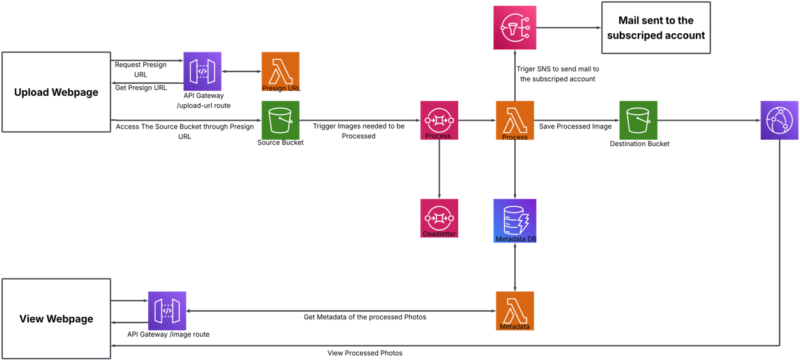

**Serverless Image Processing Pipeline** | **🚧 Feature request** | **🐛 Bug report** | **❓ General question**

**Note**: This is a personal/learning-project implementation, built manually through the AWS Management Console rather than deployed via CloudFormation or CDK. See [Customizing the Solution](#customizing-the-solution) for how to reproduce it.

## Table of Content

- [Solution Overview](#solution-overview)
- [Architecture Diagram](#architecture-diagram)
- [How It Works](#how-it-works)
- [AWS Services Used](#aws-services-used)
- [Customizing the Solution](#customizing-the-solution)
  - [Prerequisites](#prerequisites)
  - [1. Build the upload path](#1-build-the-upload-path)
  - [2. Build the processing path](#2-build-the-processing-path)
  - [3. Build the retrieval path](#3-build-the-retrieval-path)
  - [4. Test end to end](#4-test-end-to-end)
- [Environment Variables](#environment-variables)
- [Cost Notes](#cost-notes)
- [Cleanup](#cleanup)
- [License](#license)

# Solution Overview

The Serverless Image Processing Pipeline lets a client upload an image through a web page, have it automatically resized and watermarked in the background, and view the processed result — all without provisioning or managing a single server.

The client never talks to S3 or Lambda directly. Uploads go through a short-lived pre-signed URL, and reads go through a small metadata API — the client only ever calls API Gateway and CloudFront.

# Architecture Diagram

# How It Works

**Upload path**
1. The upload web page calls `API Gateway /upload-url` to request a pre-signed URL.
2. `Presign Lambda` (generates a short-lived S3 pre-signed URL and returns it — it never touches the image itself.
3. The browser uploads the image **directly to the S3 source bucket** using that URL, bypassing API Gateway and Lambda entirely for the actual file transfer.
4. The new object triggers an S3 event notification, which publishes a message to an **SQS queue**. This decouples the upload from processing, so bursts of uploads queue up instead of throttling Lambda.
5. **Processing Lambda** consumes the queue message, downloads the original image, generates a thumbnail and a watermarked full-resolution copy, and:
   - writes both outputs to the **S3 destination bucket**
   - writes a metadata record directly to **DynamoDB** (no intermediate workflow step)
   - publishes directly to an **SNS topic**, which emails the subscribed account
6. If a message fails processing repeatedly, SQS automatically routes it to a **dead-letter queue (DLQ)** instead of retrying forever.

**Retrieval path**
1. The view web page calls `API Gateway /image route` to ask what's available.
2. `Query Lambda` reads metadata directly from the same DynamoDB table used by Metadata Lambda.
3. The response tells the client which processed files exist and where.
4. The client fetches the actual image bytes from **CloudFront**, which serves the S3 destination bucket globally through cached edge locations — the client never reads from S3 directly.

# AWS Services Used

| Service | Role in this solution |
|---|---|
| Amazon S3 | Source bucket (raw uploads) and destination bucket (thumbnails + full-res output) |
| Amazon SQS | Buffers S3 upload events ahead of Processing Lambda; dead-letter queue captures repeated failures |
| AWS Lambda | Three functions: Presign (issues upload URLs), Processing (resize/watermark/store), Query (reads metadata) |
| Amazon API Gateway | Two HTTP routes: `/upload-url` and `/image`, fronting the Presign and Query Lambdas |
| Amazon DynamoDB | Single metadata table, written by Processing Lambda and read by Query Lambda |
| Amazon SNS | Notifies a subscribed email address when Processing Lambda completes |
| Amazon CloudFront | Serves the destination bucket globally over HTTPS via Origin Access Control |

# Customizing the Solution

## Prerequisites

- An AWS account with console access to S3, SQS, Lambda, API Gateway, DynamoDB, SNS, and CloudFront
- A Linux environment (or VM) matching your Lambda runtime's architecture, for building the Pillow layer
- An email address to subscribe to the SNS topic

## 1. Building the upload path

- Create the S3 **source** and **destination** buckets, both with public access blocked and versioning enabled.
- Create an SQS **processing queue** and a **DLQ**, with the queue's redrive policy pointing at the DLQ after 5 failed receives.
- Configure an S3 event notification on the source bucket (prefix `uploads/`) to publish to the SQS queue.
- Deploy **Presign Lambda**, with an inline IAM policy allowing `s3:PutObject` on the source bucket only.
- Create an HTTP API in API Gateway with a `POST /upload-url` route integrated with Presign Lambda.

## 2. Building the processing path

- Build a Lambda layer containing Pillow, targeting the same architecture and Python version as your function.
- Deploy **Processing Lambda**, triggered by the SQS queue, with permissions for `s3:GetObject` on the source bucket, `s3:PutObject` on the destination bucket, `dynamodb:PutItem`/`UpdateItem`, and `sns:Publish`.
- Create the DynamoDB table (`imageId` as partition key, on-demand billing).
- Create an SNS topic and subscribe an email address to it (confirm the subscription email before testing).

## 3. Building the retrieval path

- Deploy **Query Lambda**, with `dynamodb:GetItem`/`Query` permissions on the metadata table.
- Add a `GET /image` route to the same (or a second) API Gateway, integrated with Query Lambda.
- Create a CloudFront distribution with the destination bucket as its origin, using Origin Access Control so the bucket stays private.

## 4. Test end to end

1. Call `/upload-url`, then `PUT` an image file to the returned URL.
2. Confirm the SQS queue drains and Processing Lambda's CloudWatch logs show a successful run.
3. Confirm new objects appear in the destination bucket and a new item appears in DynamoDB.
4. Confirm the SNS subscription email arrives.
5. Call `/image` and confirm the response includes the new file's metadata.
6. Load the returned key through the CloudFront domain and confirm the image renders.

# Cleanup
To avoid dependency errors,I recommend Tear down in this order: disable and delete the CloudFront distribution, empty and delete both S3 buckets, delete the SQS queue and DLQ, delete the DynamoDB table, delete all three Lambda functions, delete the API Gateway APIs, and delete the SNS topic.

# License

This project documentation is provided for personal/educational use. Adapt freely.
